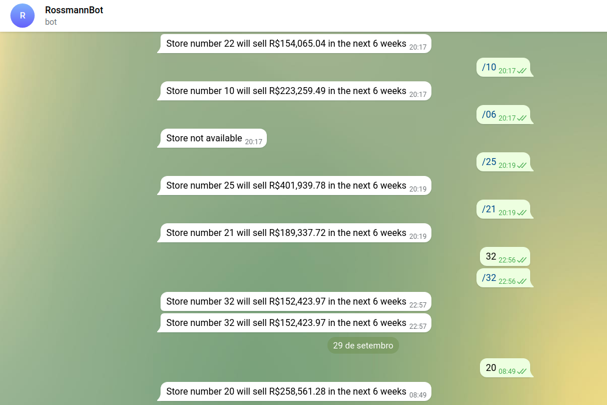

## Hi there!! My name is Alex and I am a Data Science Intern at Natura &Co.
 

 
  
  
  
  
  
  

  
  ##
 

 

  
   
  

Throughout my life I've always had a very close contact with technology, but in early 2021 I joined as an intern in the field of data science and fell in love.
With that, I decided to dedicate my studies to solving business problems using data. With that, I've been developing different types of projects, to improve my knowledge in the data world.

**Data Science Tools:**

* **Data Collect and Storage Modeling:** SQL.
* **Data Manipulation and Data Integration:** Python, Pandas.
* **Static and Exploratory Data Analytics:** Numpy, Plotly.Express, Seaborn and Pyplot.
* **Data Preparation and Feature Selection:** Scalers, Boruta, RFE.
* **Machine Learning Modeling:** Logistic and Linear Regression, Clustering and Ranking to Learn.
* **Data Visualization and Deploy:** Streamlit and Heroku.

## Data Science Projects:

### [House Prices Analytics - Analytics Problem](https://github.com/alexhenriquepineda/Data-Analysis-House-Rocket)
  * Business Question: The CEO needs to visualize the data of all the houses that we have in the company's portfolio and, along with that, he must follow a very complete analysis of this data.
  * Resolution: The project's main function is to bring a complete analysis of House Rocket's data, aiming to help the company's CEO to make the best decisions.
  * Deploy on Streamlit: https://analytics-houserocket-alx.herokuapp.com/
  * Repository: https://github.com/alexhenriquepineda/Data-Analysis-House-Rocket

### [Rossmann Sales Regression - Temporal Regression Problem](https://github.com/alexhenriquepineda/Store-Sales-Prediction)
  * Business Question: The CFO wants to renovate several stores and for that to happen, he needs to know how much each store will earn in the next 6 weeks.
  * Resolution: A Logistics Regression was applied to predict how much revenue will be for each Rossmann store. After testing several Machine Learning algorithms, the algorithm that was selected was XGBoost. He was able to forecast the sales of the stores in the next 6 weeks, with this the CFO will have this tool available to assist in decision making.
  * Repository: https://github.com/alexhenriquepineda/Store-Sales-Prediction
  * Deploy on Heroku and Telegram:
   

    

 ### [Health-Car Insurances Cross Sell - Ranking To Learn Problem ](https://github.com/alexhenriquepineda/Health-Insurance-Cross-Sell)
  * Business Question: Which are the best customers to be considered and how many of them should actually be included?
  * Resolution: ongoing project
  * Repository: https://github.com/alexhenriquepineda/Health-Insurance-Cross-Sell

 ### [Bank Marketing Strategy - Clustering Problem ](https://github.com/alexhenriquepineda/Bank-Marketing-Strategy)
  * Business Question: Create customer segmentation to help the marketing team make decisions.
  * Resolution: ongoing project
  * Repository: https://github.com/alexhenriquepineda/Bank-Marketing-Strategy

**Thank you for your attention, hope we find you out there!**
